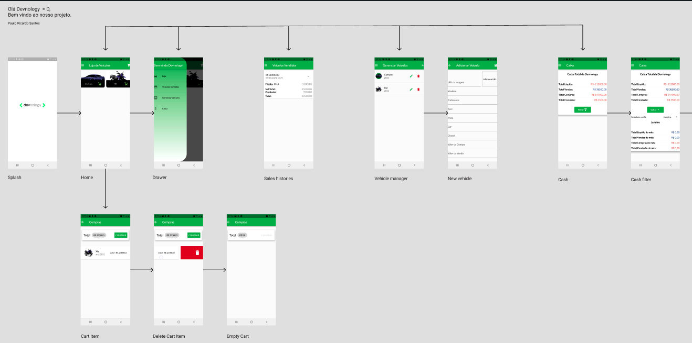

## Projeto Proposto pela Devnology


## devnology

Você precisará construir um sistema para uma agência de veículos, ele será composto por uma api e um frontend (Desktop ou Mobile).

Sinta-se à vontade para usar a linguagem que achar melhor e pode usar templates prontos, frameworks e/ou outras coisas que possam facilitar a sua vida.

Crie um arquivo readme falando um pouco sobre quais as decisões que você tomou para a resolução do exercício, e, caso não tenha feito algo, explique o motivo. Também informe os passos para fazer sua aplicação rodar, e caso tenha, o processo de deploy.

Precisamos que nosso sistema seja capaz de:

- Cadastrar a compra de um veículo, modelo, marca, ano de fabricação, placa, cor, chassi, data da compra e valor da compra.

- Registrar a venda de um veículo, com data da venda, valor da venda e comissão do vendedor (10% sobre o lucro da venda).

- Deverá ser possível listar todos os veículos, veículos disponíveis e histórico de veículos vendidos.

- Listar o valor total em compras e vendas, lucro/prejuízo do mês e o valor pago em comissões.

Caso queira criar mais funcionalidades fique à vontade, apenas se lembre de mencionar sobre elas no readme.

Qualquer dúvida entre em contato comigo pelo linkedin, estarei à disposição para esclarecer quaisquer dúvidas que surgirem.

Ao finalizar a prova basta enviar o link do repositório no linkedin.


---

<h2 align="center">Sobre 📖</h2>
   
<p>
   O projeto Devnology Car foi desenvolvido como teste proposto pela Devnology. <br>
   O Devnology Car se trata de um app mobile feito em Flutter para Gerenciamento de compra e venda de veículos, contendo recursos como o Firebase RealTime com uso de API, entre vários outros pontos, como o uso do Provider.<br>
  
</p>

---
<h2 align="center">Como Usar 🤔</h2>

   ```
   - Clone esse repositório:
   $ git clone https://github.com/Paulodev88/Devnology-Project.git

   - Entre no diretório:
   $ cd Devnology-Project

   - Instale as dependências:
   $ flutter pub get

   - Inicie o app: 
   $ flutter run
   ```

---


<h2 align="center">Layout 🎨</h2>

   <p align="center">
      
   </p>

   <p align="center">
      Você pode acessar o layout no Figma:
   
   - <a href="https://www.figma.com/file/D6xTwJPGrcgqwrbWuV7zwj/Devnology-Project?node-id=0%3A1">Mobile</a> 📱
   </p>

---

